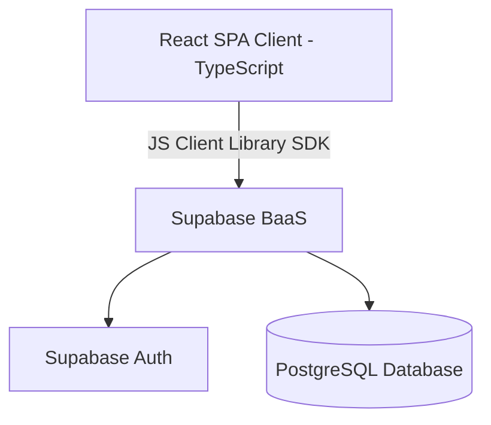
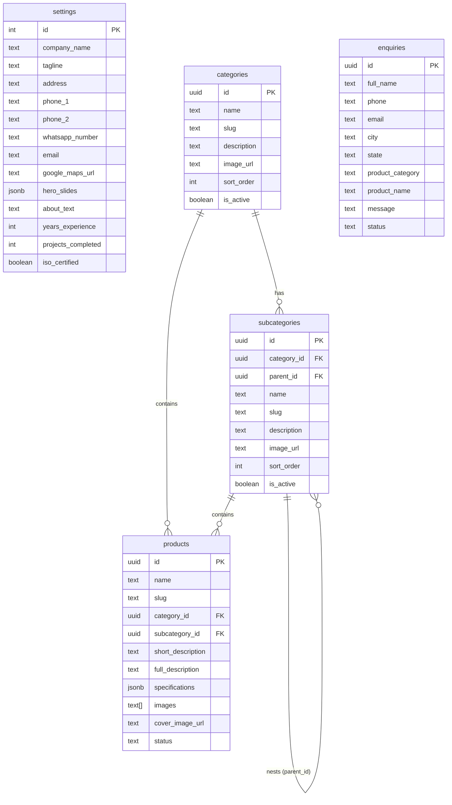
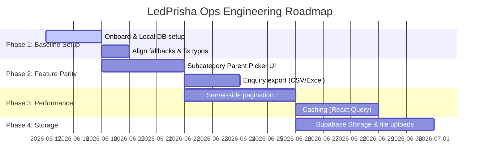

# Developer Onboarding, Architecture & Roadmap Guide
## LedPrisha Ops Portal

Welcome to the **LedPrisha Ops** project! This comprehensive developer guide will help you understand the application's architecture, walk you through the setup process step-by-step, highlight critical architectural details, outline technical gaps/optimizations, and present a strategic development roadmap.

---

## 1. System Architecture Overview

LedPrisha Ops is a modern web platform built on a **Serverless/BaaS (Backend-as-a-Service)** architecture. It utilizes a React Single Page Application (SPA) on the frontend that interacts directly with Supabase for data, authentication, and security.



### 1.1 Tech Stack
*   **Frontend Core**: React 18 (TypeScript), Vite (Build tool/Dev server)
*   **Routing**: React Router v7 (`react-router-dom`)
*   **Styling**: TailwindCSS 3.4 (with customized layers in `src/index.css`)
*   **Icons**: Lucide React
*   **Database & BaaS**: Supabase (PostgreSQL, Realtime, Row Level Security)

### 1.2 Directory Structure
Here is an overview of the key directories and files:

*   `/src`
    *   `/components`: Reusable layout and presentation elements (e.g., `Navbar`, `Footer`, `HeroSection`, Modals).
    *   `/context`: Global state providers (`AuthContext.tsx`, `SettingsContext.tsx`).
    *   `/lib`: Core configuration and global type definitions (`supabase.ts`, `types.ts`).
    *   `/pages`: Screen layouts.
        *   `/admin`: All pages containing protected administrative tools (Dashboard, Products, Enquiries, Settings, etc.).
    *   `App.tsx`: App routing and context wrapper setup.
    *   `index.css`: Styling configurations, design systems, custom animations, and utilities.
    *   `main.tsx`: Entry point for React.
*   `/supabase`: Local database schemas and migrations.
    *   `/migrations`: Versioned SQL migrations defining tables, security rules, indexes, and initial data.
*   `.env`: Credentials file containing URL and API keys.

---

## 2. Database Schema & Security Models

The application's PostgreSQL database is configured via structured migrations located in `supabase/migrations/`.

### 2.1 Table Structure & Relationships



*   **`settings` (Singleton)**: Holds globally configurable UI variables (phone numbers, address, social media links, statistics, and dynamic slides for the landing screen). A CHECK constraint enforces `id = 1` to prevent multiple rows.
*   **`categories` & `subcategories`**: Handles catalog classification. Subcategories support infinite nesting via a self-referencing `parent_id` column.
*   **`products`**: Product listings. Specifications are stored in a flexible `jsonb` field (key-value specification maps). Image links are held inside a `text[]` array.
*   **`enquiries`**: Customer lead pipeline generated from frontend submission modals.

### 2.2 Security Architecture (Row Level Security - RLS)
Supabase RLS policies are enabled across all tables (defined in `001_create_base_tables.sql`):
1.  **Anonymous/Public Users**:
    *   Can `SELECT` active content (Products with status `active`, Gallery/Catalogues/Testimonials/Sectors/FAQs/Team with `is_active = true`).
    *   Can `SELECT` general `categories`, `subcategories`, and `settings`.
    *   Can `INSERT` new entries into `enquiries` (to submit contact/lead queries).
2.  **Authenticated Users (Admins)**:
    *   Granted `ALL` operations (CRUD) across all tables.

---

## 3. Step-by-Step Developer Setup

Follow these instructions to get your local environment running.

### Step 1: Install Prerequisites
Ensure you have the following installed on your machine:
*   [Node.js](https://nodejs.org/) (Version v18.x or v20.x recommended)
*   [Git](https://git-scm.com/)
*   (Optional) [Supabase CLI](https://supabase.com/docs/guides/cli) if you plan on modifying database structures locally.

### Step 2: Clone & Install Dependencies
1.  Navigate into your project workspace.
2.  Install all packages defined in `package.json`:
    ```bash
    npm install
    ```

### Step 3: Configure Environment Variables
Create a `.env` file in the root directory of the project. Fill in your Supabase connection parameters (you can clone the keys from the existing environment settings):
```env
VITE_SUPABASE_URL=your_supabase_project_url
VITE_SUPABASE_ANON_KEY=your_supabase_anon_public_key
```

### Step 4: Setup the Database (Supabase)
To synchronize database tables, columns, indexes, and security controls:
*   **If using Supabase Cloud Console**:
    Copy the SQL scripts from `supabase/migrations/` in sequential order (from `001` to `010`) and execute them inside the Supabase SQL Editor.
*   **If using Supabase Local Development CLI**:
    ```bash
    supabase init
    # Start the local dockerized services
    supabase start
    # Apply existing migrations automatically
    supabase db push
    ```

### Step 5: Start the Development Server
Launch the local Vite development environment:
```bash
npm run dev
```
Open [http://localhost:5173](http://localhost:5173) in your browser to inspect the application.

### Step 6: Log in to the Admin Dashboard
To access `/admin`, you need to register a user account inside your Supabase project's Authentication section:
1.  Navigate to your Supabase Console -> **Authentication** -> **Users** -> **Add User** (Create User).
2.  Log in at [http://localhost:5173/admin/login](http://localhost:5173/admin/login) using those credentials. (Note: Email confirmation can be disabled in Supabase console settings for easier testing).

---

## 4. Architectural Analysis: Gaps & Technical Debt

As a senior developer onboarding onto this project, keep these structural gaps and inconsistencies in mind:

### 4.1 Nested Subcategories Admin Deficit
*   **The Issue**: The database schema (migration `005`) and frontend routing/navigation (`Navbar.tsx` & `ProductsPage.tsx`) fully support recursively nested subcategories using the `parent_id` foreign key. However, the administrative page ([AdminCategories.tsx](file:///d:/ReactWorkspace/ledprisha-ops/src/pages/admin/AdminCategories.tsx#L190-L325)) does not expose a form field to set or edit `parent_id`.
*   **Impact**: Admins cannot create or edit nested subcategories (e.g., placing "Magnetic Spot" under "Magnetic Lighting 20mm") using the UI. They are currently locked to flat category-subcategory groupings unless they write raw SQL queries in the database console.

### 4.2 In-Memory Client-Side Filtering & Search
*   **The Issue**: [ProductsPage.tsx](file:///d:/ReactWorkspace/ledprisha-ops/src/pages/ProductsPage.tsx#L80-L95) and [AdminProducts.tsx](file:///d:/ReactWorkspace/ledprisha-ops/src/pages/admin/AdminProducts.tsx#L20-L29) perform a single massive select query returning all products from the database on component load, followed by local in-memory filtering:
    ```typescript
    const filteredProducts = products.filter((p) => { ... })
    ```
*   **Impact**: This works fine for a few dozen items. However, once the site catalog scales to hundreds or thousands of products, this will result in poor loading performance, high mobile bandwidth consumption, and memory lag.

### 4.3 Missing Media Upload System
*   **The Issue**: There is no file upload logic implemented. In the Product Form, Gallery, and Catalogues admin pages, uploading files is simulated by typing or pasting raw `Image URL` or `PDF URL` text strings.
*   **Impact**: Admins must host assets elsewhere (e.g., Imgur, Pexels, Google Drive) and paste URLs. There is no direct upload functionality to Supabase Storage Buckets.

### 4.4 Hardcoded Company Brand Inconsistencies
*   **The Issue**: In [SettingsContext.tsx](file:///d:/ReactWorkspace/ledprisha-ops/src/context/SettingsContext.tsx#L11-L24), the `defaultSettings` fallback object defines the company name as `RELED` and default details to `info@reled.com`.
*   **Impact**: If the Supabase API fails or is not connected properly, the website fallback displays branding for "RELED" rather than "LedPrisha Ops".

---

## 5. Expert Optimization & Best Practices Guide

To improve the maintainability, scalability, and performance of this application, apply the following optimizations:

### 5.1 Server-Side Pagination, Filtering & Search
Refactor components to delegate querying, page partitioning, and text matching to the database engine rather than resolving them in Javascript memory.
*   **Implementation Pattern**:
    ```typescript
    // Fetch a single page of products with specific filters applied at DB level
    const fetchProducts = async (page: number, limit: number, categoryId?: string, search?: string) => {
      let query = supabase
        .from('products')
        .select('*, category:categories(name)', { count: 'exact' })
        .order('created_at', { ascending: false });
        
      if (categoryId) {
        query = query.eq('category_id', categoryId);
      }
      if (search) {
        query = query.ilike('name', `%${search}%`);
      }
      
      const from = page * limit;
      const to = from + limit - 1;
      
      const { data, count, error } = await query.range(from, to);
      return { data, count, error };
    };
    ```

### 5.2 Implement Query Caching (React Query)
The application currently queries categories and settings on almost every route change inside the `Navbar` and contexts, leading to duplicate network requests.
*   **Recommendation**: Integrate `@tanstack/react-query` to cache data globally and eliminate duplicate HTTP roundtrips. Set a generous stale time (e.g., 5-10 minutes) for static layouts like Categories, FAQs, and Settings.

### 5.3 Integrate Supabase Storage Buckets
Replace raw URL text boxes in admin forms with a drag-and-drop file upload component.
1.  Create public buckets named `product-images`, `gallery-images`, and `catalogues-pdfs` in Supabase.
2.  Build a file selection input on the admin pages that uploads files directly via the SDK:
    ```typescript
    const handleFileUpload = async (file: File) => {
      const fileExt = file.name.split('.').pop();
      const fileName = `${Math.random()}.${fileExt}`;
      const filePath = `products/${fileName}`;
      
      const { error } = await supabase.storage
        .from('product-images')
        .upload(filePath, file);
        
      if (!error) {
        const { data } = supabase.storage
          .from('product-images')
          .getPublicUrl(filePath);
        return data.publicUrl; // Use this URL in your product payload
      }
    };
    ```

---

## 6. Strategic Development Roadmap

A phased plan for developers to upgrade this codebase systematically:



### Phase 1: Baseline Verification & Identity Correction (1-3 Days)
*   **Tasks**:
    *   Verify credentials connectivity in `.env`.
    *   Change the hardcoded company settings fallback name in `SettingsContext.tsx` from `RELED` to `LedPrisha Ops`.
    *   Audit indexing; ensure `idx_products_category` and others are applied (verify via Supabase dashboard).

### Phase 2: Subcategory Level Alignment (3-5 Days)
*   **Tasks**:
    *   Modify [AdminCategories.tsx](file:///d:/ReactWorkspace/ledprisha-ops/src/pages/admin/AdminCategories.tsx) to query the current list of subcategories.
    *   Add a dropdown selector to assign a "Parent Subcategory" to allow UI management of nested subcategory trees.
    *   Ensure that updating a category slug cascades correctly or prompts warnings.

### Phase 3: Performance & Scalability (5-8 Days)
*   **Tasks**:
    *   Refactor the frontend and admin product tables to implement server-side pagination (limit to 12 items per page).
    *   Install React Query and encapsulate Supabase database client fetches.
    *   Implement lazy loading of detail modals.

### Phase 4: Media Operations Integration (8-12 Days)
*   **Tasks**:
    *   Configure Supabase Storage Buckets.
    *   Integrate a file upload handler in product creation, gallery, and catalogue forms with progress bar feedback.
    *   Provide automated image scaling limits (e.g. compress uploaded photos before posting them to the bucket to reduce load times).

---

If you have questions, refer to the official [Supabase Documentation](https://supabase.com/docs) and [React Router Documentation](https://reactrouter.com/). Happy coding!
